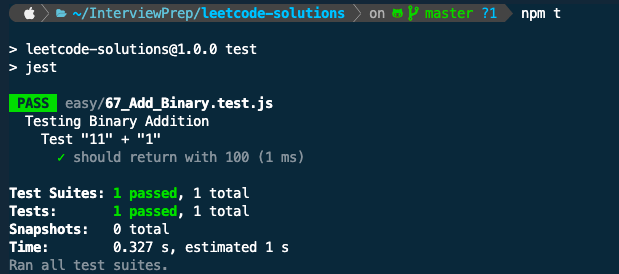

# Welcome to Leet Code Solutions - editor language Javascript
> Sharing my solutions and approach to solving the infamous Leetcode problems.

> ## Things to note
- I am using javascript as my programming language.

> ## How to use ?
- You'll need VSCode editor
- Once you have it, make sure you have git,node(>v8) & npm(>v8) installed on your system
- After that, open terminal or powershell and paste the command 
``` .sh
    git clone https://github.com/mSaurabh/leetcode-solutions.git
```
- While still in Terminal or Shell, go inside the folder (that just got created in the step above) and type
``` .sh
    npm i && code .
```

> ## How to run test cases ?
- Inside the VSCode terminal window type 
``` .sh
    npm test
```
- You should see an output like this
    - 

> ## How can I contribute ?
- I'd love that, if you can contribute solutions to other problems or a better solution to my existing ones, just make sure you don't overwrite my solution and create PR with new file named as "Problem-Title_Initials_Date_v#.js" 
    - Where 
        - Problem-Title = Use Snake case for this (Check my existing file for example)
        - Initials = your initials
        - Date = Your local Date in mmddyyyy format
        - v# = version number
- As far as test cases go, just add your test case inside the already existing test case file and make sure it works before submitting the PR. Thanks!

> ## Finally, Good Luck with your Interview!!

